

<h1>🐈 웹 기반 반려동물 행동 감지 및 분석 도우미 🐈‍⬛</h1>

   
### 👩🏻‍💻 _새싹 강동캠퍼스 2기 변정민 개인 과제입니다._ 👩🏻‍💻

---
## ❓ 이 사이트는요

- 고양이 이미지를 업로드하면 학습된 YOLO11 모델이 해당 이미지에서 고양이의 행동을 예측합니다. 

[🎞️시연 영상 링크](https://youtu.be/OoCMH8PNAOM)

---
## 🌐 웹사이트 주소

[집사야 뭘 쳐다보냥😺](https://flask-chat-app-915768071749.asia-northeast3.run.app/)
- GCP에 배포는 성공하였으나 서버 비용 등의 문제로 인해 런타임을 중지시킨 상태입니다. 

---
## 🐈 탐지 가능한 행동
1. cat_eating(밥 먹는 모습)
2. cat_lying(누워 있는 모습)
3. cat_sitting(앉아 있는 모습)
4. cat_sleeping(자고 있는 모습)
5. cat_standing(서 있는 모습)
6. cat_yawning(하품하는 모습)

---
## ⭐ 기술 스택
1. 데이터 전처리 : Roboflow
</a>

   1-1. 데이터 라벨링, 증식, 증강

2. 딥러닝 모델 : Yolo11 
</a>

   2-1. 이미지 속 고양이 행동을 학습 및 예측하는 모델

3. 백엔드 : Flask 
</a>

   3-1. 파이썬 기반으로 웹 페이지를 구현

4. 프론트엔드 : HTML, CSS, JS
</a>
</a>
</a>

   4-1. 웹 페이지 디자인

---
## 📆 개발 기간
- 2025.07.30 ~ 2025.08.08

---
## 📂 사용한 데이터셋
- 반려묘(하쿠) 이미지 1989장 + Roboflow에서 다운로드 한 고양이 이미지 768장 = 총 2757장

- 데이터셋은 다음과 같은 기준을 동일하게 적용하여 내보냄

    - 데이터의 비율은 Train:Valid를 8:2로 나눔
  
    - 이미지 사이즈는 640*640으로 통일
  
    - 부족한 부분은 검은색으로 채우기
  
    - 이미지 증강은 좌우 반전과, -15˚~15˚ 회전만 적용
  
    - 버전 사이즈는 2x로 설정

---
## 📉 모델링 결과
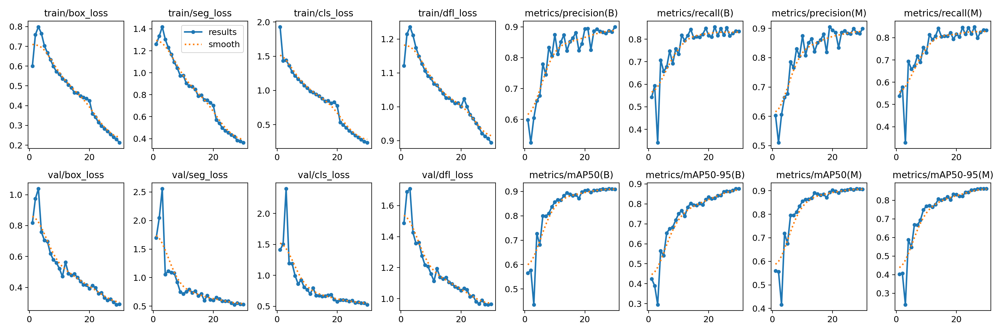
- YOLO11s segment 모델로 학습한 결과 박스, Seg 마스크, 클래스 등의 손실은 학습이 진행될수록 작아지고, 정밀도, 재현율 등은 0.9 즈음으로 수렴함

    - 정밀도 : 모델이 고양이라고 예측한 것 중 실제로 고양이가 맞은 비율
  
    - 재현율 : 실제 이미지에 있는 모든 고양이 중 모델이 찾아낸 고양이의 비율

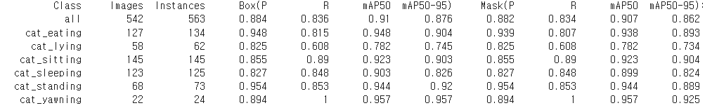
- Validation 데이터로 YOLO 모델을 검증해본 결과 cat_lying에서 가장 낮은 성능을 보임

- 고양이의 눕는 자세가 다양하거나, sleeping과 같은 다른 클래스와 혼동했기 때문이라고 생각됨

---
## 💡 의의
- 하쿠 이미지만 사용했을 때와, 다른 품종의 고양이 데이터까지 사용했을 때를 비교하면 후자의 경우에서 ‘다른 품종의 고양이’ 이미지의 테스트 정확도가 상당히 좋아짐

- 두 경우 모두에서 하쿠 이미지의 테스트 정답률은 100%

| 하쿠 이미지만 사용했을 때 | 다른 고양이 이미지도 사용했을 때 |
| :-:  | :-: |
| 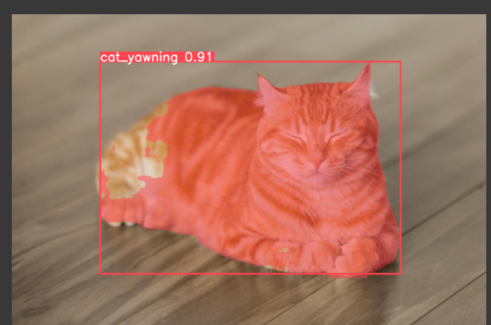 | 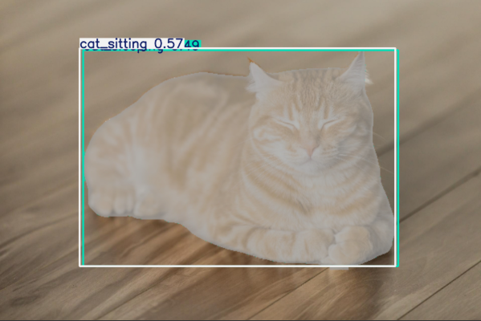 |
| 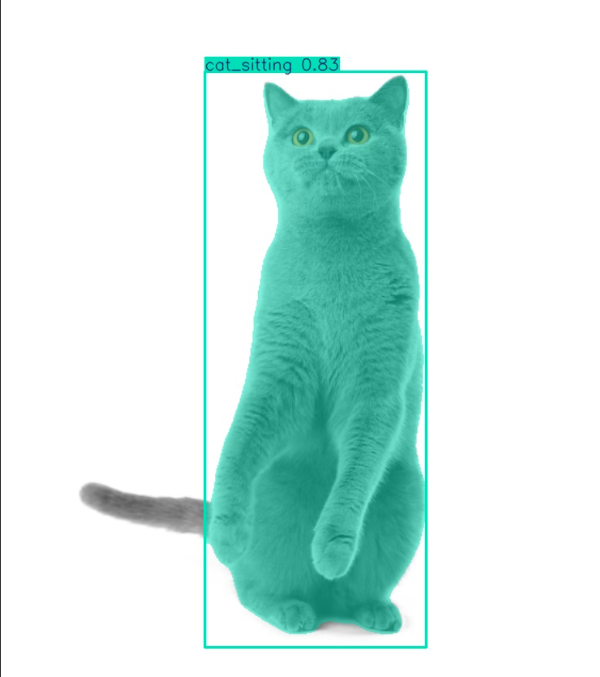 | 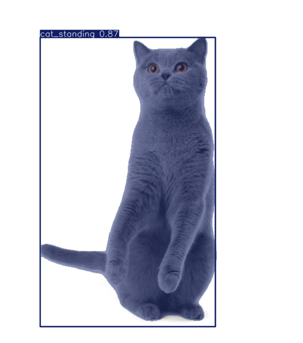 |
| 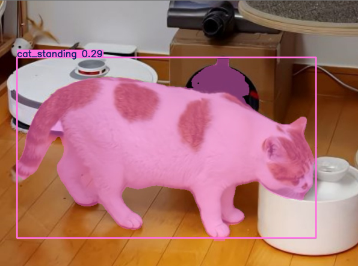 | 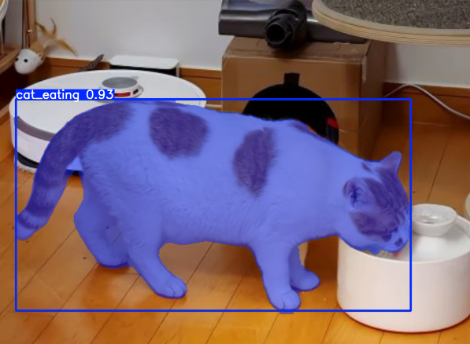 |
| 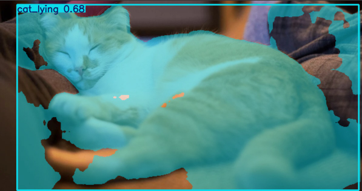 | 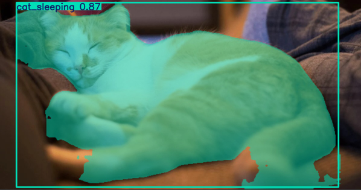 |
| 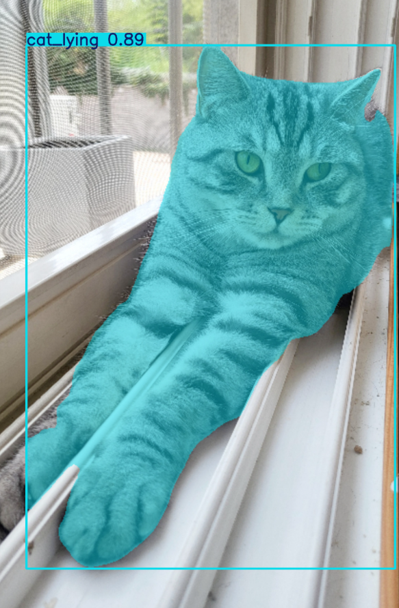 | 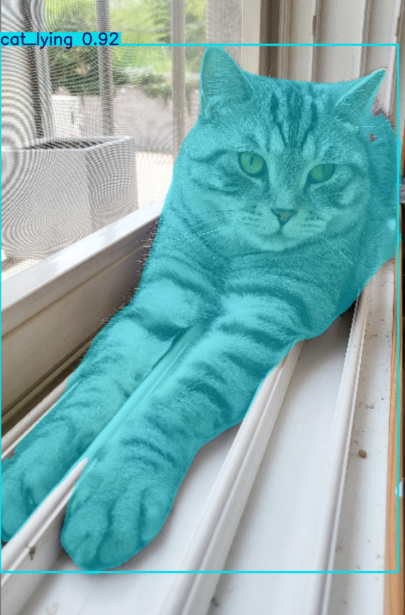 |
| 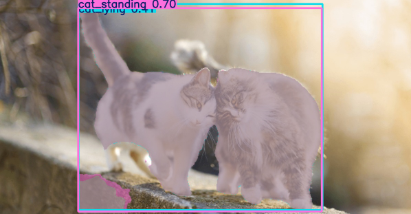 | 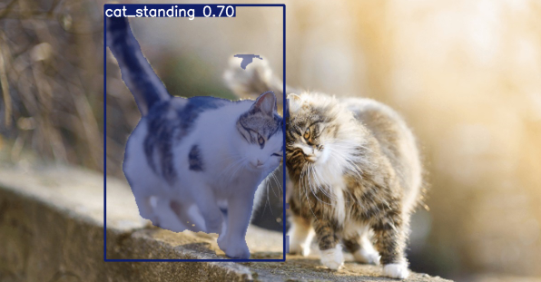 |
| 테스트 데이터 정답률 3/8 | 테스트 데이터 정답률 6/8 |

---
## 🥲 한계
- 기간 상의 여유가 없어 좀 더 방대한 데이터셋을 구축하지 못함

- 고양이에만 초점이 맞추어져 있어 강아지와 고양이가 같이 있는 사진에서 개를 고양이로 판단함

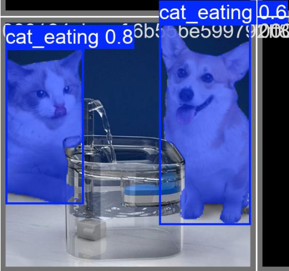

- 객체가 두 마리 이상인 경우를 잘 구분하지 못할 때가 있음

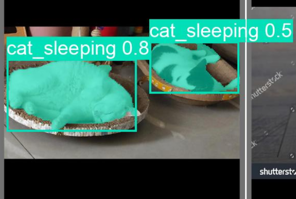

- 두 가지 행동 양상이 동시에 나타날 경우 모델이 오답을 보임

- 각 클래스별 이미지 개수가 균일하지 않음

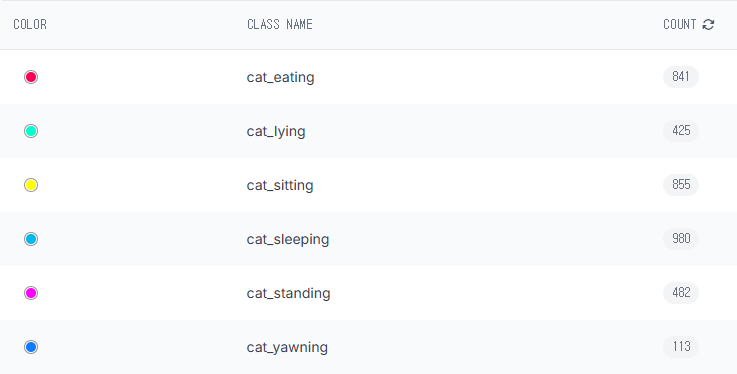

---
## 🚀 프로젝트 발전 방향
- 그루밍과 talking 클래스 추가

    - 그루밍의 경우 lying, sleeping, eating과 혼동 여지 있음
  
    - talking의 경우 yawning과 혼동 여지 있음

- eating 클래스를 밥 먹기와 물 마시기로 분리

- 강아지와 같은 다른 종의 동물을 구분할 수 있도록 별도의 라벨링

- 이미지 데이터뿐만 아니라 영상 데이터에서도 탐지가 가능하도록 영상 데이터셋 구축

---
### 🔗 보다 자세한 정보는 ...
1. [계획서](https://docs.google.com/document/d/1hEPHCC6kBZtsp58v5-ov2zFL8bd7LzVTM9wJpdJWfMw/preview?tab=t.0)
2. [PPT 발표 자료](https://docs.google.com/presentation/d/1QVrJAyfDiPl5RBFEZpTXP8nsxzzLl2QgrjvU3m0s2qw/edit?slide=id.p1#slide=id.p1)
